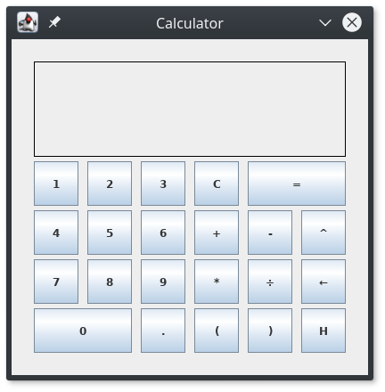

# Calculator
Simple java-based calculator with GUI



### Compiling

Simply run
```
make
```

### Running the program

Run the executable
```
Calculator.sh
```

### Uninstalling

Remove compiled class files with
```
make clean
```
